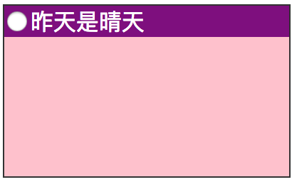

## 乱七八糟的vertical-align

2018-02-28

emmm...写这个的初衷是：经常用vertical-align: middle都不起作用的样子，于是，就想研究一下😊。

    vertical-align具有的属性：长度，百分值(%)，baseline(默认值)，sub，super，top，text-top，middle，bottom，text-bottom，inherit。

**敲黑板：`vertical-align`只适用于`inline-level`元素，即`inline`,`inline-block`或`inline-table`。而且，位置都是相对于父元素的基线！！！**

属性的含义：

* 长度: 通过距离升高（正值）或降低（负值）元素。`0cm`等同于`baseline`

* 百分数: 通过距离（相对于`line-height`值的百分大小）升高（正值）或降低（负值）元素。`0%`等同于`baseline`。

* baseline: 默认值。元素的基线与父元素的基线对齐。
* sub: 降低元素的基线到父元素合适的下标位置。
* super: 升高元素的基线到父元素合适的上标位置。
* top: 把对齐的子元素的顶端与line box顶端对齐。
* text-top: 把元素的顶端与父元素内容区域的顶端对齐。
* middle: 元素的中垂点与父元素的基线加1/2父元素中字母x的高度对齐。 （ --> emmm...张大大的说法，很是形象了= =）
* bottom: 把对齐的子元素的底端与line box底端对齐。
* text-bottom: 把元素的底端与父元素内容区域的底端对齐。
* inherit: 从父元素继承`vertical-align`属性的值。

---

### 一些实例

1. `vertical-align: 数值`

  ```html
  <div class="wrapper">
    <div class="test">
      <input type="radio" name="test1" value="n" />昨天是晴天
    </div>
  </div>
  ```
  ```css
  .wrapper {
    margin: auto;
    width: 200px;
    height: 120px;
    background: pink;
    border: 1px solid #333;
  }
  .test {
    background: purple;
    color: white;
  }

  .test input {
    vertical-align: 1px; // 相对于基线向上偏移一像素
  }
  ```
  

2. 子div在父div中垂直居中
  ```html
  <div class="parent">
    <div class="child"></div>
  </div>
  ```
  ```css
  .parent {
    width: 400px;
    height: 300px;
    background: #003366;
    display: table-cell;
    vertical-align: middle;
  }
  .child {
    width: 100px;
    height: 80px;
    background: white;
  }
  ```
  

  这里有个诡异的问题：`display: inline-block;`就不能实现垂直居中！而`display: table-cell;`就可以！！按理来说应该都可以才对啊！等后续搞清楚了再追！

参考文章：

  [我对CSS vertical-align的一些理解与认识（一）](http://www.zhangxinxu.com/wordpress/2010/05/%E6%88%91%E5%AF%B9css-vertical-align%E7%9A%84%E4%B8%80%E4%BA%9B%E7%90%86%E8%A7%A3%E4%B8%8E%E8%AE%A4%E8%AF%86%EF%BC%88%E4%B8%80%EF%BC%89/)
