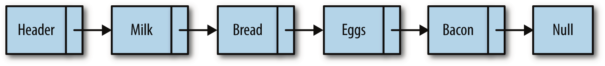
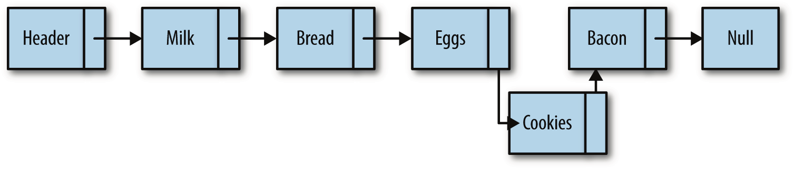
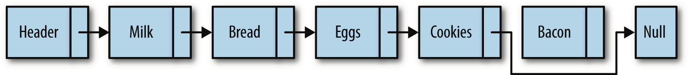

### js实现单链表

一般的链表都会额外添加一个头节点(作为辅助)和尾节点，例如:

数组元素靠它们的位置进行引用,链表元素则是靠相互之间的关系进行引用。在上图中,我们说 bread 跟在 milk 后面,而不说 bread 是链表中的第二个元素。遍历链表,就是跟着链接,从链表的首元素一直走到尾元(但这不包含链表的头节点,头节点常常用来作为链表的接入点)。上图中另外一个值得注意的地方是,链表的尾元素指向一个 null 节点。

插入:

向单向链表中插入一个节点,只需要修改它前面的节点(前驱),使其指向新加入的节点,而新加入的节点则指向原来前驱指向的节点。

删除:

从链表中删除一个元素也很简单。只需要将待删除元素的前驱节点指向待删除元素的后继节点。

**敲重点！代码实现:**

[prototype实现js单链表](./codes/链表/prototype实现js单链表.html)

[this实现js单链表](./codes/链表/this实现js单链表.html)

参考文章：

  [js实现链表](https://www.cnblogs.com/EganZhang/p/6594830.html)

  [数据结构：用JS实现链表](https://blog.csdn.net/weixin_38181873/article/details/78153779)