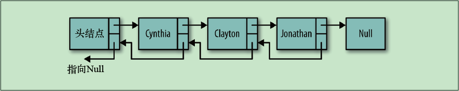
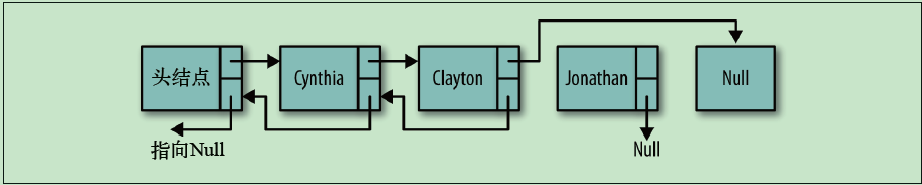

### js实现双向链表

双向链表的工作原理:

双向链表的删除remove()方法比单项链表的效率更高，因为不需要查找前驱节点了。首选需要在链表中找出存储待删除数据的节点，然后设置该节点的next属性，使其指向待删除节点的后续。设置该节点的后续的previous的属性，使其指向待删除节点的前驱。下图展示了删除节点的过程:

代码实现：

[方法一](./codes/链表/js实现双向链表.html) --- 更容易实现在某个位置新增和删除节点

[方法二](./codes/链表/js实现双向链表2.html) --- 整体结构更清晰，实现更优雅，反向遍历更方便

参考文章:

  [javascript中的链表结构—双向链表](https://www.cnblogs.com/tylerdonet/p/5894677.html)

  [数据结构：用JS实现链表](https://blog.csdn.net/weixin_38181873/article/details/78153779)