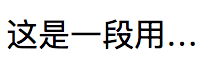
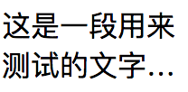

### word-break、white-space、word-wrap异同及其应用实例

2018-03-02

### 一、基础知识

1. **word-break**

  `MDN`上说：`CSS` 属性 `word-break` 指定了怎样在单词内断行。

  `word-break`的常用属性：
  * `normal`: 使用默认的换行规则。
  * `break-all`: 允许任意非CJK(Chinese/Japanese/Korean)文本间的单词断行。
  * `keep-all`: 不允许CJK(Chinese/Japanese/Korean)文本中的单词换行，只能在半角空格或连字符处换行。非CJK文本的行为实际上和normal一致。

  `global values`:
  * word-break: inherit;
  * word-break: initial;
  * word-break: unset;

  此外，还有一个非官方标准的`break-word`值，其表现和`word-wrap: break-word`一样。

2. **word-wrap**

  ```css
  /* 关键字值 */
  word-wrap: normal;
  word-wrap: break-word;

  /* 全局值 */
  word-wrap: inherit;
  word-wrap: initial;
  word-wrap: unset;
  ```

  `break-word`: 表示如果行内没有多余的地方容纳该单词到结尾，则那些正常的不能被被分割的单词会被强制分割换行。

  *注意: CSS3规范里，把`word-wrap`属性的名称给改了，叫做：`overflow-wrap`。然而，只有`Chrome/Safari`等`WebKit/Blink`浏览器支持。所以，还是用`word-wrap`比较多。

3. **white-space**

  `white-space` CSS 属性是用来设置如何处理元素中的空白。

  MDN-语法:

  ```css
  white-space: normal;
  white-space: nowrap;
  white-space: pre;
  white-space: pre-wrap;
  white-space: pre-line;
  white-space: inherit;
  ```

  其中:

  **normal** --- 连续的空白符会被合并，换行符会被当作空白符来处理。填充line盒子时，必要的话会换行。

  **nowrap** --- 和`normal`一样，连续的空白符会被合并。但文本内的换行无效。

  **pre** --- 连续的空白符会被保留。在遇到换行符或者`<br>`元素时才会换行。

  **pre-wrap** --- 连续的空白符会被保留。在遇到换行符或者`<br>`元素，或者需要为了填充line盒子时才会换行。

  **pre-line** --- 连续的空白符会被合并。在遇到换行符或者`<br>`元素，或者需要为了填充line盒子时会换行。


### 二、实例

1. div超出隐藏并显示省略号

  ```html
  <div class="box">这是一段用来测试的文字</div>
  ```
  ```css
  .box {
    width:100px;
    overflow: hidden;
    white-space: nowrap;
    text-overflow: ellipsis;
  }
  ```
  

2. div超出2行隐藏并显示省略号

  ```html
  <div class="box">这是一段用来测试的文字。这是一段用来测试的文字。</div>
  ```
  ```css
  .box {
    width: 100px;
    text-overflow:ellipsis;
    display: -webkit-box;
    -webkit-box-orient: vertical;
    -webkit-line-clamp: 2;
    overflow: hidden;
    word-break: break-all;
  }
  ```
  

参考文章：

  [word-break:break-all和word-wrap:break-word的区别](http://www.zhangxinxu.com/wordpress/2015/11/diff-word-break-break-all-word-wrap-break-word/)
