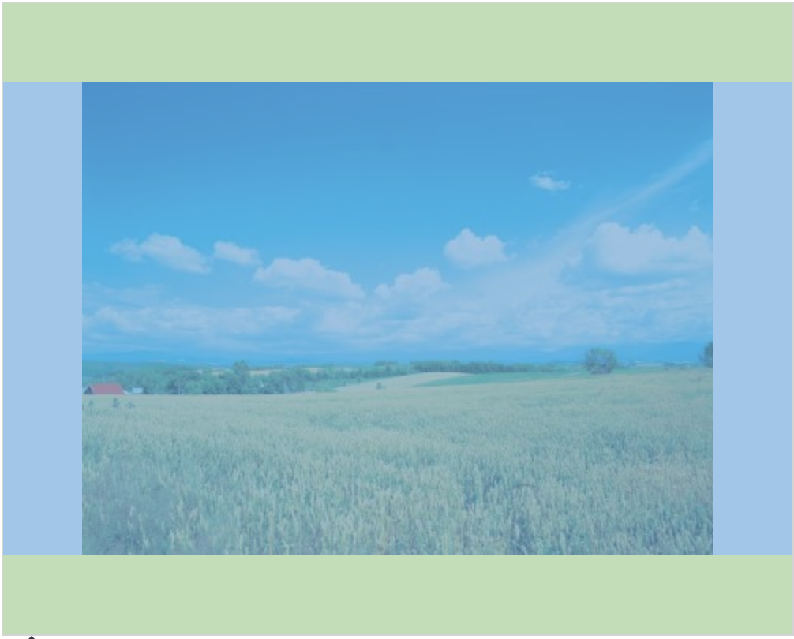

## css的各种居中

2018-02-28

作为一名前端coder，各种各样各种情况下的居中效果可谓是数不胜数，而要快速、准确、优雅、高效的完成这样的css效果可以说是一名前端coder的必备技能了！像我这种小菜鸟，哪怕是曾经做过的效果，如果没有经常使用的话，遇到类似问题时，也不能快速的解决问题。emmm...所以呢，为了让自己慢慢想大牛们靠近，趁着有时间，赶紧充充电，记录一下，哈哈。

### display: table实现图片在div中水平垂直居中

```html
<div id="box">
  <span>
    
  </span>
</div>
```
```css
#box{
  width: 500px;
  height: 400px;
  display: table;
  border: 1px solid #d3d3d3;
  background:#fff;
}
#box span{
  display: table-cell;
  vertical-align: middle;
}
#box img{
  display: block;
  margin: 0 auto;
}
```

效果如图：


### 行内元素水平居中

```html
<div class="parent">
   <span class="child">child</span>
</div>
```
```css
.parent {
   text-align: center;
}
```
### 行内元素垂直居中（单行文字）
html结构同`行内元素水平居中`
```css
.parent {
   height: 200px;
   line-height: 200px;
   border: 1px solid red;
}
```

### 块级元素水平居中
```html
<div class="parent">
   <div class="child">child</div>
</div>
```
```css
.parent {
    text-align: center;
}
.child {
    width: 100px;
    margin: auto;
    border: 1px solid blue;
}
```
### display: table-cell实现多行文字的垂直居中处理

```html
<div class="parent">
    <span class="child">child child child child child child child child child child child child child child child child child child child childchild child child </span>
</div>
```
```css
.parent {
  width: 400px;
  height: 300px;
  display: table-cell;
  vertical-align: middle;
  border: 1px solid red;
}
.child {
  display: inline-block;
  vertical-align: middle;
  background: green;
  color: #fff;
}
```

### 块级元素水平垂直居中

```html
<div class="parent">
   <div class="child">child</div>
</div>
```
**方法一：绝对定位，`margin`负值**
```css
.parent{
  position: relative;
  width: 500px;
  height: 400px;
  background: #fff;
  border: 1px solid #d3d3d3;
}
.child{
  position: absolute;
  width: 400px;
  height: 300px;
  left: 50%;
  top: 50%;
  margin-left: -200px;
  margin-top: -150px;
  background: purple;
  color: #fff;
}
```

**方法二：绝对定位+transform**
```css
.parent {
  position: relative;
  width: 200px;
  height: 200px;
  border: 1px solid #333;
}
.child {
  position: absolute;
  top: 50%;
  left: 50%;
  background: pink;
  transform: translate(-50%, -50%);
}
```
**方法三：绝对定位+margin：auto**
```css
.parent {
  position: relative;
  height: 200px;
  width: 200px;
  border: 1px solid #333;
}
.child {
  width: 80px;
  height: 40px;
  position: absolute;
  left: 0;
  top: 0;
  right: 0;
  bottom: 0;
  margin: auto;
  background: purple;
  color: #fff;
}
```

**方法四：display: table-cell**
```css
.parent {
  width: 600px;
  height: 200px;
  border: 1px solid red;
  display: table;
  text-align: center;
}
.child {
  display: table-cell;
  vertical-align: middle;
}
或
.parent {
  height: 200px;
  width: 200px;
  border: 1px solid red;
  display: table-cell;
  vertical-align: middle;
  text-align: center;
}
```

**方法五：display: flex**
```css
.parent {
  width: 300px;
  height: 200px;
  border: 1px solid red;
  display: flex;
  align-items: center;
  justify-content: center;
}
```

**方法六：伪元素**
```css
.parent {
  width: 300px;
  height: 300px;
  border: 1px solid red;
  text-align: center;
}
.child {
  background: blue;
  width: 100px;
  height: 40px;
  display: inline-block;
  vertical-align: middle;
}
.parent::before {
  content: '';
  height: 100%;
  display: inline-block;
  vertical-align: middle;
}
```

**方法七：calc()**
```css
.parent {
  width: 300px;
  height: 300px;
  border: 1px solid red;
  position: relative;
}
.child {
  width: 100px;
  height: 100px;
  background: blue;
  padding: -webkit-calc((100% - 100px) / 2);
  padding: -moz-calc((100% - 100px) / 2);
  padding: -ms-calc((100% - 100px) / 2);
  padding: calc((100% - 100px) / 2);
  background-clip: content-box;
}
```

参考文章：

  [未知高度的图片在div设置垂直居中](http://www.cnblogs.com/leejersey/p/3780415.html)

  [CSS设置居中的方案总结-超全](https://juejin.im/post/5a7a9a545188257a892998ef)
